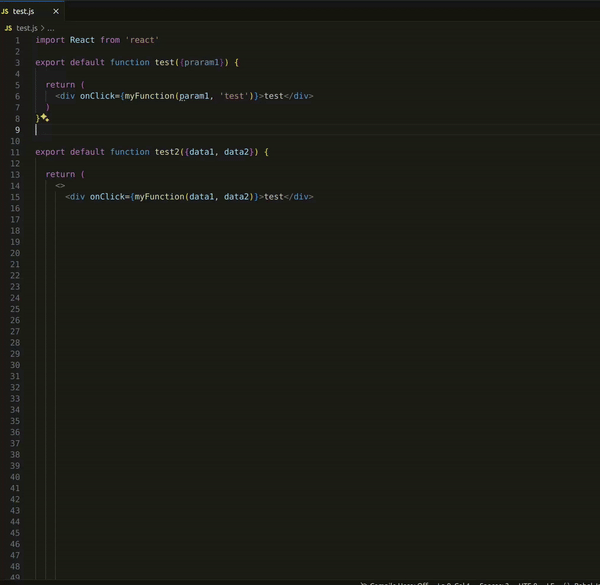

# Free Function

This extension provides developers in React projects with a simple way to create functions, enhancing efficiency and effectiveness in coding.

## Features

The main features of it extension:

- Automatic Function Generation: Automatically generates a function based on the parameters provided. Simply specify the parameters you want, and the function is created automatically.

- Easy Usage: It's incredibly easy to use in React projects. Just write the code to call a function.

- Rapid Definition: There's no need to write complex code to create a function. You can quickly define a function based on the given parameters.

 ## How to use

 

## Installation

1. Open Visual Studio Code.
2. Click on the Extensions icon on the left menu (or use the `Ctrl+Shift+X` shortcut).
3. Type `"Free Function"` in the search bar and find your extension.
4. Click the Install button to install the extension.

## Usage

Provide instructions on how to use the extension here. This could include commands, shortcuts, or menu options that provide access to features.

## Settings

There is currently no settings section available, but it will be included in future updates.

## Contributing

--

## License

`This extension is licensed under the [MIT License](LICENSE).`
